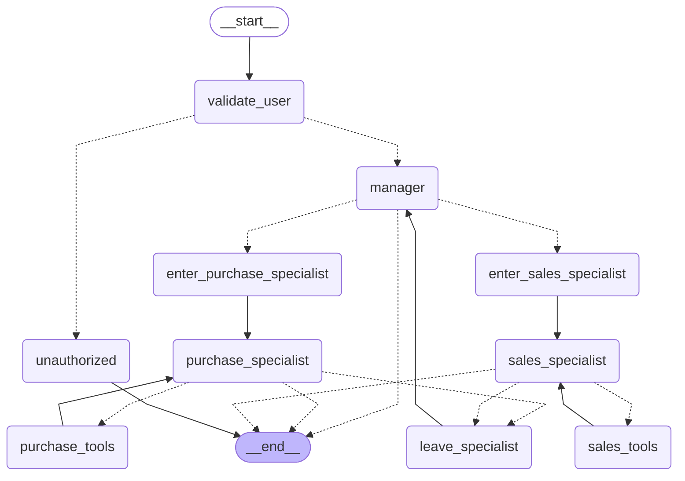

```mermaid
---
config:
  flowchart:
    curve: linear
---
graph TD;
	__start__([<p>__start__</p>]):::first
	validate_user(validate_user)
	unauthorized(unauthorized)
	manager(manager)
	enter_purchase_specialist(enter_purchase_specialist)
	purchase_specialist(purchase_specialist)
	purchase_tools(purchase_tools)
	enter_sales_specialist(enter_sales_specialist)
	sales_specialist(sales_specialist)
	sales_tools(sales_tools)
	leave_specialist(leave_specialist)
	__end__([<p>__end__</p>]):::last
	__start__ --> validate_user;
	enter_purchase_specialist --> purchase_specialist;
	enter_sales_specialist --> sales_specialist;
	leave_specialist --> manager;
	manager -.-> __end__;
	manager -.-> enter_purchase_specialist;
	manager -.-> enter_sales_specialist;
	purchase_specialist -.-> __end__;
	purchase_specialist -.-> leave_specialist;
	purchase_specialist -.-> purchase_tools;
	purchase_tools --> purchase_specialist;
	sales_specialist -.-> __end__;
	sales_specialist -.-> leave_specialist;
	sales_specialist -.-> sales_tools;
	sales_tools --> sales_specialist;
	validate_user -.-> manager;
	validate_user -.-> unauthorized;
	unauthorized --> __end__;
	classDef default fill:#f2f0ff,line-height:1.2
	classDef first fill-opacity:0
	classDef last fill:#bfb6fc

```
